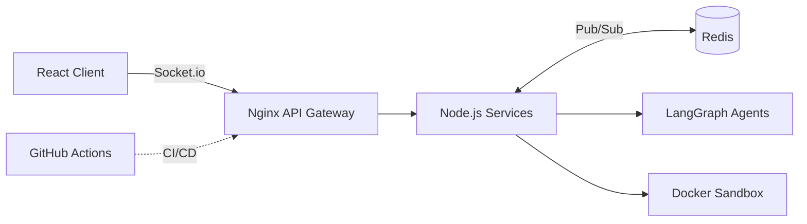

<div align="center">


<a href="https://github.com/deepanshutri8033">
  
</a>

<br/><br/>


&nbsp;
[](https://github.com/deepanshutri8033?tab=followers)
&nbsp;


<br/>


</div>

---

## 🧑‍💻 About Me

```python
class Deepanshu:
    name       = "Deepanshu Tripathi"
    location   = "Prayagraj, Uttar Pradesh, India 🇮🇳"
    education  = "B.Tech CSE @ UIT Prayagraj (Graduating 2028)"

    specialty  = ["Full-Stack Engineering", "Agentic AI Workflows", "Distributed Systems"]
    stack      = ["React", "Next.js 15", "Node.js", "Python", "FastAPI", "TypeScript"]
    ai_devops  = ["LangGraph", "Inngest", "Redis", "Docker", "PostgreSQL", "MongoDB"]

    wins       = ["2× Hackathon Finalist 🏆 (JanNetra — 100+ teams)"]
    grind      = "300+ problems solved on LeetCode & GFG ⚡"

    currently  = "Architecting multi-agent orchestration systems 🚀"
    goal       = "Build resilient, ultra-fast software that scales effortlessly."

    def say_hi(self):
        print("Let's build something impactful together!")
```

---

## 🛠️ Tech Arsenal

<div align="center">

**Languages**


**Frontend**


**Backend & AI Infra**


**Databases & Tools**


<br/>


</div>

---

## 🚀 Featured Projects

### 🧠 NeuralPad — Real-Time AI Code Editor & Collaborative IDE

> High-throughput collaborative workspace powered by multi-agent AI and isolated runtimes.



- ⚡ **Microservices:** Nginx gateway + Redis Pub/Sub handling 50+ concurrent requests under 100ms latency
- 🤖 **LangGraph engine:** multi-agent state orchestration, ~40% faster generation with live streaming
- 🔒 **Sandboxed runtimes:** isolated command execution in Docker, automated CI/CD via GitHub Actions

`React` `Node.js` `Redis` `LangGraph` `Docker` `Socket.io` `Nginx`

---

### 🤖 Agentica — Autonomous Multi-Tool AI Agent Platform

> Production-grade web automation and scheduled event execution.

- 🔌 **Agent pipelines** using OpenAI Agents SDK, Gemini and Composio OAuth across 8+ external tools
- ⏱️ **Background queues** with Inngest for reliable retries and job concurrency
- 🔐 **Security & persistence:** Clerk Auth, Drizzle ORM + Neon (PostgreSQL), deployed on Vercel

`Next.js 15` `PostgreSQL` `Drizzle ORM` `Inngest` `Composio` `Clerk`

---

### 🔬 Enterprise Deep Research & Agentic RAG Platform

> Grounded retrieval and multi-node research routing.

- 🕸️ **Graph routing:** query expansion across 5+ vector nodes with LangGraph `StateGraph`
- ✅ **Hallucination control:** programmatic verification with page citations, ~35% fewer false outputs
- 🛡️ **Guardrails & streaming:** prompt-injection protection, low-latency FastAPI streaming

`Python` `LangGraph` `FastAPI` `ChromaDB` `AWS`

---

### 🏆 JanNetra — AI-Powered Smart Governance Platform

> **2× Hackathon Finalist**, competed against **100+ teams**

<details>
<summary><b>📊 Click to view impact metrics</b></summary>
<br/>

| Metric | Impact |
|--------|--------|
| 👥 Citizens onboarded | 500+ |
| 📉 Manual triage reduction | ~40% |
| 📈 Engagement boost | +50% |
| 🗂️ Issue categories | 10+ |
| 🎮 Gamified participation | +35% |

</details>

`React` `Tailwind` `FastAPI` `MongoDB` `Supabase` `Recharts`

---

## 💼 Experience

**Software Engineering Intern — Code Resite** · *June 2025 – July 2025 · Remote*

- Led full-stack work on 5 live client apps (React, Node, Express, MongoDB) within a 4-developer pod
- Resolved 15+ critical backend bottlenecks, improving response times by ~30%
- Enforced MVC patterns and Git workflows, speeding up sprint delivery by ~20%

---

## 📊 GitHub Performance

<div align="center">


&nbsp;


<br/>


<br/>


<br/>

<!-- Animated snake: see snake/snake.yml in the download and place it at .github/workflows/snake.yml -->
<picture>
  <source media="(prefers-color-scheme: dark)" srcset="https://raw.githubusercontent.com/deepanshutri8033/deepanshutri8033/output/github-snake-dark.svg" />
  
</picture>

</div>

---

## 🏆 Awards & Certifications

| | Achievement |
|---|---|
| 🏆 | **2× Hackathon Finalist**, JanNetra (100+ teams) |
| 📜 | **Full-Stack Development**, Apna College |
| 🧠 | **Data Structures & Algorithms**, Apna College |
| ⚡ | **300+ problems solved** on LeetCode & GeeksforGeeks |

---

## 🤝 Connect With Me

<div align="center">

[](https://github.com/deepanshutri8033)
[](https://linkedin.com/in/deepanshu-tripathi)
[](mailto:deepaktri8033@gmail.com)
[](https://leetcode.com)

<br/>


**⭐ Leave a star if you find something useful!**

</div>
